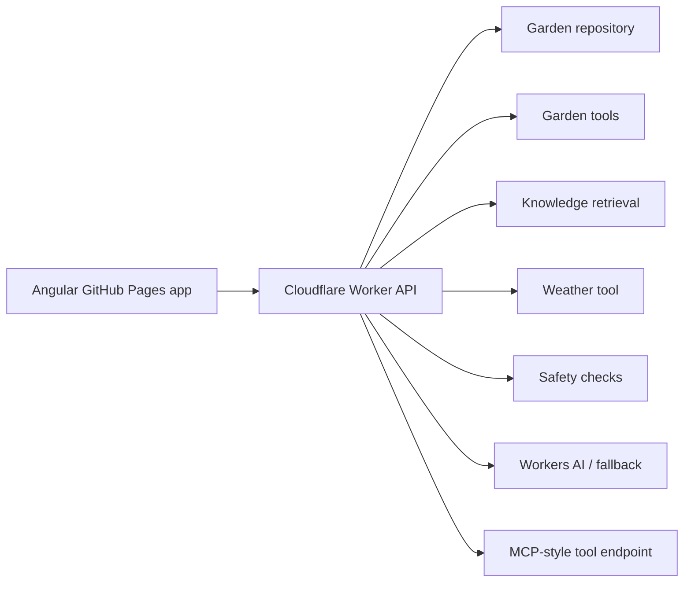

# AI Garden Copilot Architecture

AI Garden Copilot is structured as a TypeScript-first AI product:

## Frontend

- Angular 22
- Standalone components
- Zoneless change detection
- Built-in control flow with `@if` and `@for`
- Vite/esbuild build through `@angular/build`
- GitHub Pages deployment under `/ai-garden-copilot/app/`

## Backend

- Cloudflare Worker for production
- Node/TypeScript API for local development parity
- Server-side AI provider access only
- No browser-exposed AI keys
- SSE streaming for visible Copilot workflow events

## AI Workflow

The Copilot does not answer directly from the prompt alone. It gathers context first:

1. Load tracked plants.
2. Load selected plant.
3. Retrieve trusted garden knowledge.
4. Fetch weather.
5. Run guardrails.
6. Generate a structured recommendation.
7. Request human approval before writes.

## Retrieval

The current RAG layer uses a small project-authored knowledge base and plant-aware retrieval. Workers AI embeddings are used when available, with deterministic lexical fallback for the public demo.

Vectorize is the next storage upgrade once the knowledge base grows beyond an in-process corpus.

## Safety

Safety is implemented as product behavior, not just prompt wording:

- write actions require approval
- weather absence is surfaced as a warning
- risky chemical-treatment questions are flagged
- vision analysis is treated as observation support, not diagnosis

## Deployment

- Landing and Angular app: GitHub Pages
- API: Cloudflare Workers
- Weather: Open-Meteo
- AI: Cloudflare Workers AI free-first, optional OpenAI backend fallback
