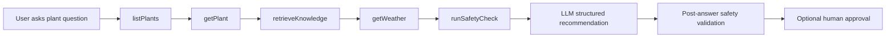

# Phase 5 Implementation - Agentic Workflow, MCP & Safety

Phase 5 turns the Copilot workflow into a clearer agent-style orchestration loop. The app now gathers plant state, retrieves knowledge, checks live weather, applies guardrails, and only then asks the model for a structured recommendation.

## Implemented Features

- Agent-style SSE workflow with explicit tool steps:
  - `listPlants`
  - `getPlant`
  - `retrieveKnowledge`
  - `getWeather`
  - `runSafetyCheck`
  - structured recommendation
  - optional approval request
- Weather tool using the free Open-Meteo forecast API for the configured garden location.
- Safety service with pre-answer checks for human approval, unavailable weather, missing observation history, and risky chemical-treatment questions.
- Post-answer safety validation that flags recommendations mentioning chemical treatment.
- Structured recommendation context now includes:
  - retrieved knowledge sources
  - weather context
  - safety checks
- Angular UI now shows Weather and Guardrails alongside Sources.
- Lightweight MCP-style JSON-RPC endpoint at `/mcp` exposing garden tools for external clients.
- Phase 5 eval smoke suite covering retrieval, weather, guardrails, and MCP tool exposure.

## Agent Workflow

The Phase 5 stream intentionally exposes each orchestration step to the UI. This makes the AI behavior inspectable instead of hiding everything behind one model response.



## MCP Surface

The first MCP-style surface is intentionally stateless and lightweight for Cloudflare Workers:

- `GET /mcp` returns server metadata and available tools.
- `POST /mcp` accepts JSON-RPC requests for:
  - `initialize`
  - `tools/list`
  - `tools/call`

Available tools:

- `getGarden`
- `listPlants`
- `getPlant`
- `retrieveKnowledge`
- `getWeather`

This is not yet a full authenticated production MCP server. It is a portfolio-ready first slice that shows how the garden domain can be exposed as tools.

## Evaluation

Run the Phase 5 smoke suite:

```bash
npm run eval:phase5
```

The current checks verify:

- retrieval returns sources
- weather context is attached
- risky treatment guardrail is triggered
- MCP tool list exposes retrieval and weather tools

## Official References

- Open-Meteo Forecast API: https://open-meteo.com/en/docs
- Cloudflare Workers best practices: https://developers.cloudflare.com/workers/best-practices/workers-best-practices/
- Cloudflare Agents and MCP docs: https://developers.cloudflare.com/agents/model-context-protocol/

## Phase Boundary

This phase does not yet introduce persistent agent memory, Durable Objects, OAuth for MCP clients, formal LLM-as-judge evaluations, or a full production safety policy. Those are natural next hardening steps.
